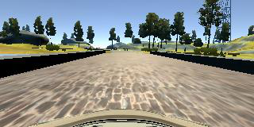
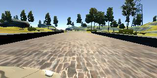
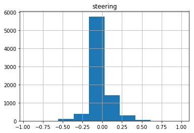
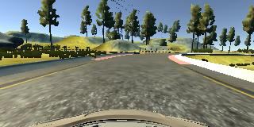
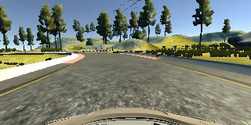
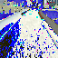
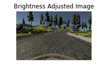
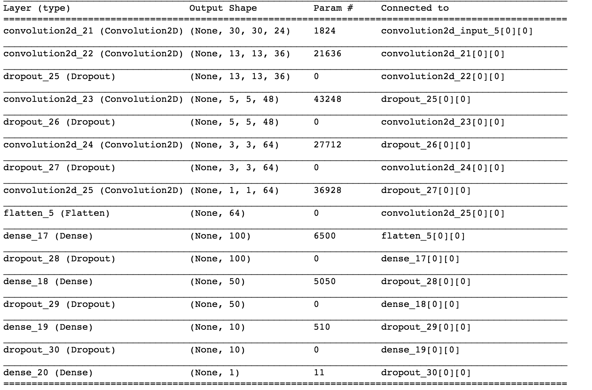

**Behavioral Cloning** 


**Behavioral Cloning Project**

The goals / steps of this project are the following:
* Use the simulator to collect data of good driving behavior
* Build, a convolution neural network in Keras that predicts steering angles from images
* Train and validate the model with a training and validation set
* Test that the model successfully drives around track one without leaving the road
* Summarize the results with a written report

### Model Architecture and Training Strategy

#### 1. Solution Design Approach

The overall strateg for deriving a model architecture was to able to dirve the car in the automos mode by the code.

Based on the video lecture, I used the Nivida model to design the architecture, the model is shown below:

My final model consisted of the following layers:

| Layer         		|     Description	        					| 
|:---------------------:|:---------------------------------------------:| 
| Input         		| 64x64x3 RGB image   							| 
| Convolution 5x5x24    | border_mode='valid', subsample=(2, 2)         |
| RELU					|												|
| Convolution 5x5x36 	| border_mode='valid', subsample=(2, 2)	        |
| RELU              	|                                            	|
| Dropout               | 0.2                                           |
| Convolution 5x5x48    | border_mode='valid', subsample=(2, 2)         |
| RELU		            |         							            |
| Dropout		        | 0.2   					                    | 
| Convolution 3x3x64    | subsample=(1, 1)                              |
| RELU		            |        									    |
| Dropout		        | 0.2   					                    |
| Convolution 3x3x64	| subsample=(1, 1) 							    |
| Flatten		        | 							                    |
| Dense                 | 100                                           |
| RELU, L2_Regularize   | 0.001 									    |
| Dropout		        | 0.5     									    |
| Dense		            | 50       					                    |
| RELU, L2_Regularize   | 0.001										    |
| Dropout		        | 0.5    									    |
| Dense		            | 10						                    |
| RELU, L2_Regularize   | 0.001										    |
| Dropout		        | 0.5        					                |
| Dense              	| 1										        |
| linear		        | 							                    |

The orginal image captured from the camera is shown below:

                                            center 


                                            left 


                                            right



Then I did some exploration of the data sets of the steering angle, and below shows the history graph of the distribution:

                                           



we can see that most of the steering angles are close to zero, on the negative angle side.

Method:
The size of the image can be reduced by half by ignoring the non-usefull portions of the image.

The images can be flipped horizontally (and invert the corresponding steering angle), so that we can reduce the bias for turing left.

We can incorporate the left & right camera images to simulate recovery, when the steering anlge is close to zero.

In order to gauge how well the model was working, I split my image and steering angle data into a training and validation set. To get a good result, I spent lots of time on different proprocessing methods, by first resize the original image into (64, 64) size, then I darker the image by adding uniform feature to the V channel of HSV, then covert it back to RGB image, lastly, I normalize the image with zero mean.

Below is the result of the augment image:

                               center steering 0.06

                               
                               left steering 0.06 + 0.25 = 0.31


                                flip the center image steering -0.06


                               normalized image , cropped to 64 x 64 size






The final step was to run the simulator to see how well the car was driving around track one. There were a few spots where the vehicle fell off the track, to improve the driving behavior in these cases, I use the augment_data function in the model.py file, which randomly choose the center, left, and the right images, if the image is left, I add the offset angle to reduce the bias, if the image is right, I subtract the offset angle to do same purpose, this process largely strength my model performance.

At the end of the process, the vehicle is able to drive autonomously around the track without leaving the road.

#### 2. Final Model Architecture

The final model architecture (model.py get_model function) consisted of a convolution neural network with the following layers and layer sizes:

Here is a visualization of the architecture (note: visualizing the architecture is optional according to the project rubric)




#### 3. Creation of the Training Set & Training Process
In this project, I only use the udacity given data to get good results in the final model, and I also collect some other datas to test it.

For the given data, in the load data fucntion(model.py), I use the pandas library to load the data as CSV file, and shuffle it in the data frame, then I split into 80% of the training sets and 20% of the testing sets.

I used this training data for training the model. The validation set helped determine if the model was over or under fitting. The ideal number of epochs was 5 as evidenced by testing diffeernt variation of number, I try different values with 3,5,8, and so on, based the val loss and model performance in the automous mode, I found that with epochs 5, the model is good enough to finish the whole trail without cross any lines in the video as is shown in video.mp4. I used an adam optimizer so that manually training the learning rate wasn't necessary.


```python

```
