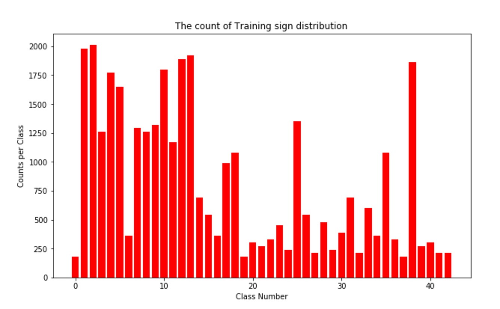
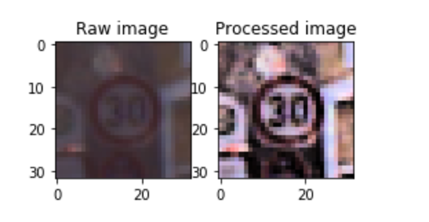
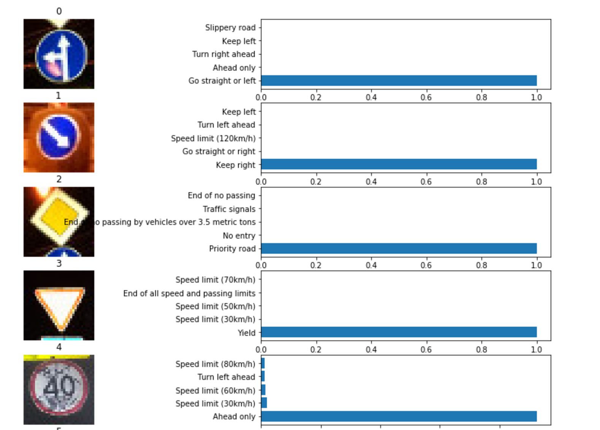

# **Traffic Sign Recognition** 

---

[//]: # (Image References)

[image1]: ./examples/visualization.jpg "Visualization"
[image2]: ./examples/grayscale.jpg "Grayscaling"
[image3]: ./examples/random_noise.jpg "Random Noise"
[image4]: ./examples/placeholder.png "Traffic Sign 1"
[image5]: ./examples/placeholder.png "Traffic Sign 2"
[image6]: ./examples/placeholder.png "Traffic Sign 3"
[image7]: ./examples/placeholder.png "Traffic Sign 4"
[image8]: ./examples/placeholder.png "Traffic Sign 5"


*Build a Traffic Sign Recognition Project**

The goals / steps of this project are the following:
* Load the data set (see below for links to the project data set)
* Explore, summarize and visualize the data set
* Design, train and test a model architecture
* Use the model to make predictions on new images
* Analyze the softmax probabilities of the new images
* Summarize the results with a written report


[//]: # (Image References)

[image1]: ./examples/visualization.jpg "Visualization"
[image2]: ./examples/grayscale.jpg "Grayscaling"
[image3]: ./examples/random_noise.jpg "Random Noise"
[image4]: ./examples/placeholder.png "Traffic Sign 1"
[image5]: ./examples/placeholder.png "Traffic Sign 2"
[image6]: ./examples/placeholder.png "Traffic Sign 3"
[image7]: ./examples/placeholder.png "Traffic Sign 4"
[image8]: ./examples/placeholder.png "Traffic Sign 5"

## Rubric Points
### Here I will consider the [rubric points](https://review.udacity.com/#!/rubrics/481/view) individually and describe how I addressed each point in my implementation.  

---
### Writeup / README

#### 1. Provide a Writeup / README that includes all the rubric points and how you addressed each one. You can submit your writeup as markdown or pdf. You can use this template as a guide for writing the report. The submission includes the project code.

You're reading it! and here is a link to my [project code](https://github.com/udacity/CarND-Traffic-Sign-Classifier-Project/blob/master/Traffic_Sign_Classifier.ipynb)

## Data Set Summary & Exploration
#### 1. Provide a basic summary of the data set. In the code, the analysis should be done using python, numpy and/or pandas methods rather than hardcoding results manually


I used the pandas library to calculate summary statistics of the traffic
signs data set:

* The size of training set is ?
* The size of the validation set is ?
* The size of test set is ?
* The shape of a traffic sign image is ?
* The number of unique classes/labels in the data set is ?

From the given data sets:

Number of training examples = 34799

Number of testing examples = 12630

Image data shape = (32, 32, 3)

Number of classes = 43

#### 2. Include an exploratory visualization of the dataset.

Here is an exploratory visualization of the data set. It is a bar chart showing how the data is distributed in each class among 43 classes.



## Design and Test a Model Architecture

#### 1. Describe how you preprocessed the image data. What techniques were chosen and why did you choose these techniques? Consider including images showing the output of each preprocessing technique. Pre-processing refers to techniques such as converting to grayscale, normalization, etc. (OPTIONAL: As described in the "Stand Out Suggestions" part of the rubric, if you generated additional data for training, describe why you decided to generate additional data, how you generated the data, and provide example images of the additional data. Then describe the characteristics of the augmented training set like number of images in the set, number of images for each class, etc.

As a first step, I decided to sharpen the image by using a gaussison blur to remove the noise.
Then, I use HSV Histogram normalization in v channel to nomalized the brightness, becasue according to the raw image, some of the picture can't even tell with human eyes, so I thought this might make the picture looks more clear and also keep the color channel in the raw image instead of grayscale it.

I decided to generate additional data because the more high quality datas feed into the neura network, the better the model will be trained, so I use the rotate function to modify the orginal picture with angle range between -15 ~ 15. 

To add more data to the the data set, for the data augmentaion part, I tripple the original data in the training sets, double the validation sets of the original data, and keep the testing sets unchanged, it shows the new data set:

X_train_process_data : (104397, 32, 32, 3)

X_valid_process_data : (8820, 32, 32, 3)

X_test_process_data : (12630, 32, 32, 3)


Here is an example of an original image and an augmented image:



The difference between the original data set and the augmented data set is you can easily tell the brightness of the augment image. 


#### 2. Describe what your final model architecture looks like including model type, layers, layer sizes, connectivity, etc.) Consider including a diagram and/or table describing the final model.

My final model consisted of the following layers:

| Layer         		|     Description	        					| 
|:---------------------:|:---------------------------------------------:| 
| Input         		| 32x32x3 RGB image   							| 
| Convolution 5x5     	| 1x1 stride, valid padding, outputs 28x28x32 	|
| RELU					|												|
| Max pooling	      	| 2x2 stride,  outputs 14x14x32 				|
| Convolution 5x5	    | 1x1 stride, valid padding, outputs 10x10x64	|
| RELU                  |                                               |
| Max pooling           | 2x2 stride,  outputs 5x5x64                   |
| Flatten		        | output 1600        							|
| Fully connected		| input 1600, output 800    					|
| RELU					|												|
| Dropout				|												|    
| Fully connected       | input 800, output 120                         |
| RELU		            |        									    |
| Fully connected		| input 800, output 84        					|
| RELU					|												|
| Fully connected		| input 84, output 43							|
 

#### 3. Describe how you trained your model. The discussion can include the type of optimizer, the batch size, number of epochs and any hyperparameters such as learning rate.

To train the model, I used an AdamOptimizer to optimize the loss_operation, the bath size is 128, I use 15 epochs, with an learning rate 0.005, and the dropout value 0.5


#### 4. Describe the approach taken for finding a solution and getting the validation set accuracy to be at least 0.93. Include in the discussion the results on the training, validation and test sets and where in the code these were calculated. Your approach may have been an iterative process, in which case, outline the steps you took to get to the final solution and why you chose those steps. Perhaps your solution involved an already well known implementation or architecture. In this case, discuss why you think the architecture is suitable for the current problem.

My final model results were:
* training set accuracy of ?
* validation set accuracy of ? 
* test set accuracy of ?

After 15 epochs training:

the final validatoion accuracy is 96.2%

the test accuracy is 95.7%

If an iterative approach was chosen:
* What was the first architecture that was tried and why was it chosen?
* What were some problems with the initial architecture?
* How was the architecture adjusted and why was it adjusted? Typical adjustments could include choosing a different model architecture, adding or taking away layers (pooling, dropout, convolution, etc), using an activation function or changing the activation function. One common justification for adjusting an architecture would be due to overfitting or underfitting. A high accuracy on the training set but low accuracy on the validation set indicates over fitting; a low accuracy on both sets indicates under fitting.
* Which parameters were tuned? How were they adjusted and why?
* What are some of the important design choices and why were they chosen? For example, why might a convolution layer work well with this problem? How might a dropout layer help with creating a successful model?

The first architecture that was tried is the LeNet model within the lecture, I get roughly 88% of the accuracy,its the basic architecture widely used in deep learning, so I start modify based on the LeNet, because the validation accuracy is low and the number of the convolutional layer channels are low based on the large amount of the data sets, also it doesn't have any tech to prevent overfiting of the model. 

Thus I start increase the output image channels based on the convolution layer w from $Input = 32x32x3. Output = 28x28x32$. this process largely divide the features more specificly into the convnet, and I increse the amount by $2^n$, after 2 convolutional layers , with fully connected layers, I use the dropout part to prevent the overfitting of the model, and I add an extra fully connected layer to drop down dimention slowly to the end classification. 

After the model is modified, I first use the epochs wih 10 and learning rate 0.001 for the training, and the dropout is set to 0.5, the validation accuracy is close to 95%, which is okay to pass the test, but I want to increse more about the accuracy, so I increse the epochs to 15 and slower the rate to 0.0005, this modify prameter will slow down the learning process,which makes the learning more smooth, after several rounds of turing these prameters, I get 96.2% validation accuracy and 95.7% test accuracy. But I believe this model can still be improved by having better preprocessing images, if I have time to work on in the future.

The design choices in this trafic sign classification problem is I use the convolution net base for the deep learning, these convolution process and max pooling are mainly for extracting the information from the image pixels, the idea behind the dropout process is to randomly loose information to prevent overfitting, if we fit the model too well, the test accuracy may not good as expected. So we have to balance between thses situations.

If a well known architecture was chosen:
* What architecture was chosen?
* Why did you believe it would be relevant to the traffic sign application?
* How does the final model's accuracy on the training, validation and test set provide evidence that the model is working well?

### Test a Model on New Images

#### 1. Choose five German traffic signs found on the web and provide them in the report. For each image, discuss what quality or qualities might be difficult to classify.

I test ten German traffic signs that I found on the web,

Here are only show five German traffic signs :

 

 

 

The 4th images might be difficult to classify because there is no classifiction label for  Speed limit (40km/h) in our classification label,so it will always go wrong.

#### 2. Discuss the model's predictions on these new traffic signs and compare the results to predicting on the test set. At a minimum, discuss what the predictions were, the accuracy on these new predictions, and compare the accuracy to the accuracy on the test set (OPTIONAL: Discuss the results in more detail as described in the "Stand Out Suggestions" part of the rubric).

Here are the results of the prediction:

| Image			        |     Prediction	        					| 
|:---------------------:|:---------------------------------------------:| 
| Go straight or left   | Go straight or left   						| 
| Keep right     	    | Keep right 								    |
| Priority Road			| Priority Road									|
| Yield	      		    | Yield					 				        |
| Speed limit (40km/h)  | arrow head     							    |
 

The model was able to correctly guess 4 of the 5 traffic signs, which gives an accuracy of 80%. This compares to the test set is lower, becasue some of the signs are not labeled in in the training classification, so when new image comes, there is not trained label for it, so it went wrong.


#### 3. Describe how certain the model is when predicting on each of the five new images by looking at the softmax probabilities for each prediction. Provide the top 5 softmax probabilities for each image along with the sign type of each probability. (OPTIONAL: as described in the "Stand Out Suggestions" part of the rubric, visualizations can also be provided such as bar charts)

The code for making predictions on my final model is located in the 11th cell of the Ipython notebook.

Here only list the first five images:




```python

```
